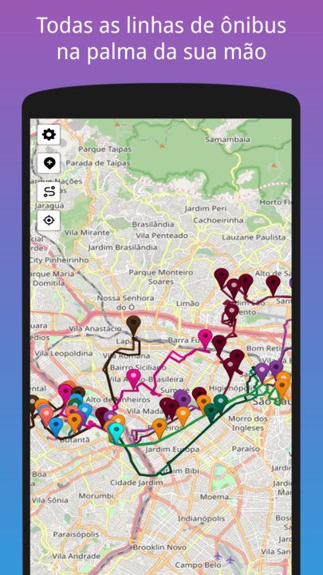

<p align="center">
  
  <h1 align="center">Ônibus USP</h1>
</p>

<p align="center">
  <a aria-label="License" href="https://github.com/bususp/bususp/blob/main/LICENSE">
    
  </a>
  <a aria-label="Nextjs" href="https://github.com/vercel/next.js/discussions">
    
  </a>
  <a aria-label="Leaflet" href="https://leafletjs.com">
    
  </a>
</p>

<p align="center">
  <a aria-label="Vercel" href="https://vercel.com">
    
  </a>
  <a aria-label="Open Street Map" href="https://openstreetmap.org">
    
  </a>
</p>


# Sobre



**Onibusp** é um aplicativo para desenvolvido para rastreamento das linhas municipais de ônibus que passam pela Cidade Universitária "Armando de Salles Oliveira" (Campus USP-Capital). Este [monorepo](https://en.wikipedia.org/wiki/Monorepo) hospeda o front-end e o back-end da aplicação.


# Arquitetura

## Frontend

O frontend é uma aplicação [Nextjs](https://nextjs.org/) e usa a biblioteca [react-leaflet](https://react-leaflet.js.org/) para fazer ponte com o [leaflet](https://leafletjs.com/).

## Backend

O backend é composto for funções lambda (serverless) hospedadas no [Vercel](https://vercel.com/).


### Especificação da API

#### `POST` /api/position

Obtêm a posição dos ônibus a partir da requisão à API da SPTrans. Esta rota armazena os dados obtidos da SPTrans em um **cache** com 4.5 segundos de retenção. Isto é, a frequencia global de aquisição de dados à API do SPTrans é de 4.5 segundos independentemente do número de usuários do aplicativo.


# Desenvolvimento

## Requisitos

* [Nodejs](https://nodejs.org/en/)
* [NPM](https://www.npmjs.com/)

## Primeiros passos

1. Clone este repositório
  
    ```git clone https://github.com/onibusp/onibusp.git```

2. Instale as dependências:

    ```npm i```

3. Inicie o servidor de desenvolvimento:

    ```npm run dev```

4. Tudo pronto para começar a programar!


## Estrutura de diretório do projeto
* `art`: logotipos
* `components`: componentes React
* `data`: dados
* `pages`: páginas Nextjs
* `pages/api`: funções lambda (backend)
* `public`: arquivos estáticos que são copiados durante a compilação
* `scripts`: scripts de automação de tarefas
* `styles`: folhas de estilo .sass
* `utils`: funções utilitárias usadas no frontend e no backend


# API SPTrans

Aqui tem um sumário de alguns recursos disponibilizados pela SPTrans que são relevantes no desenvolvimento desta aplicação

## Informação dos trajetos
Os Trajetos são obtidos a partir do seguinte recurso: `http://olhovivo.sptrans.com.br/KmlFile/<nome da linha com sentido>?D=2022-5-3&V=45`

`<nome da linha>` por exemplo **8012-10-1** ou **2012-10-2**


## Informação da posição dos veículos
`http://olhovivo.sptrans.com.br/data/Posicao/Linha?codigoLinha=<id da linha>`

`<id da linha>` por exemplo **2023**


## Informação das linhas rastreadas

### Modelo de dados

Recurso SPTrans: `http://api.olhovivo.sptrans.com.br/v2.1/Linha/Buscar?termosBusca=<nome da linha>`

`<nome da linha>` por exemplo **8012-10**

|Chave|Descrição|
|---|---|
|`cl`|Código identificador da linha. Este é um código identificador único de cada linha do sistema (por sentido de operação)|
|`lc`|Indica se uma linha opera no modo circular (sem um terminal secundário)|
|`lt`|Informa a primeira parte do letreiro numérico da linha|
|`tl`|Informa a segunda parte do letreiro numérico da linha, que indica se a linha opera nos modos: **BASE (10), ATENDIMENTO (21, 23, 32, 41)**|
|`sl`|Informa o sentido ao qual a linha atende, onde 1 significa Terminal Principal para Terminal Secundário e 2 para Terminal Secundário para Terminal Principal|
|`tp`|Informa o letreiro descritivo da linha no sentido Terminal Principal para Terminal Secundário|
|`ts`|Informa o letreiro descritivo da linha no sentido Terminal Secundário para Terminal Principal|

### Respostas

#### 8012-10
```json
[
  {
    "cl": 2023,
    "lc": false,
    "lt": "8012",
    "sl": 1,
    "tl": 10,
    "tp": "CID. UNIVERSITÁRIA",
    "ts": "METRÔ BUTANTÃ"
  }, 
  {
    "cl": 34791,
    "lc": false,
    "lt": "8012",
    "sl": 2,
    "tl": 10,
    "tp": "CID. UNIVERSITÁRIA",
    "ts": "METRÔ BUTANTÃ"
  }
]
```

#### 8022-10
```json
[
  {
    "cl": 2085,
    "lc": false,
    "lt": "8022",
    "sl": 1,
    "tl": 10,
    "tp": "CID. UNIVERSITÁRIA",
    "ts": "METRÔ BUTANTÃ"
  }, 
  {
    "cl": 34853,
    "lc": false,
    "lt": "8022",
    "sl": 2,
    "tl": 10,
    "tp": "CID. UNIVERSITÁRIA",
    "ts": "METRÔ BUTANTÃ"
  }
]
```

#### 8032-10
```json
[
  {
    "cl": 2545,
    "lc": true,
    "lt": "8032",
    "sl": 1,
    "tl": 10,
    "tp": "CID. UNIVERSITÁRIA",
    "ts": "METRÔ BUTANTÃ"
  },
  {
    "cl": 35313,
    "lc": true,
    "lt": "8032",
    "sl": 2,
    "tl": 10,
    "tp": "CID. UNIVERSITÁRIA",
    "ts": "METRÔ BUTANTÃ"
  }
]
```

#### 177H-10
```json
[
  {
    "cl": 630,
    "lc": false,
    "lt": "177H",
    "sl": 1,
    "tl": 10,
    "tp": "CID. UNIVERSITÁRIA",
    "ts": "METRÔ SANTANA"
  },
  {
    "cl": 33398,
    "lc": false,
    "lt": "177H",
    "sl": 2,
    "tl": 10,
    "tp": "CID. UNIVERSITÁRIA",
    "ts": "METRÔ SANTANA"
  }
]
```

#### 701U-10
```json
[
  {
    "cl": 657,
    "lc": false,
    "lt": "701U",
    "sl": 1,
    "tl": 10,
    "tp": "CID. UNIVERSITÁRIA",
    "ts": "METRÔ SANTANA"
  },
  {
    "cl": 33425,
    "lc": false,
    "lt": "701U",
    "sl": 2,
    "tl": 10,
    "tp": "CID. UNIVERSITÁRIA",
    "ts": "METRÔ SANTANA"
  }
]
```

#### 702U-10
```json
[
  {
    "cl": 1330,
    "lc": false,
    "lt": "702U",
    "sl": 1,
    "tl": 10,
    "tp": "TERM. PQ. D. PEDRO II",
    "ts": "CID. UNIVERSITÁRIA"
  },
  {
    "cl": 34098,
    "lc": false,
    "lt": "702U",
    "sl": 2,
    "tl": 10,
    "tp": "TERM. PQ. D. PEDRO II",
    "ts": "CID. UNIVERSITÁRIA"
  }
]
```

#### 7181-10
```json
[
  {
    "cl": 1332,
    "lc": false,
    "lt": "7181",
    "sl": 1,
    "tl": 10,
    "tp": "TERM. PRINC. ISABEL",
    "ts": "CID. UNIVERSITÁRIA"
  },
  {
    "cl": 34100,
    "lc": false,
    "lt": "7181",
    "sl": 2,
    "tl": 10,
    "tp": "TERM. PRINC. ISABEL",
    "ts": "CID. UNIVERSITÁRIA"
  }
]
```

#### 7411-10
```json
[
  {
    "cl": 1376,
    "lc": true,
    "lt": "7411",
    "sl": 1,
    "tl": 10,
    "tp": "PÇA. DA SÉ",
    "ts": "CID. UNIVERSITÁRIA"
  },
  {
    "cl": 34144,
    "lc": true,
    "lt": "7411",
    "sl": 2,
    "tl": 10,
    "tp": "PÇA. DA SÉ",
    "ts": "CID. UNIVERSITÁRIA"
  }
]
```

#### 7725-10
```json
[
  {
    "cl": 472,
    "lc": false,
    "lt": "7725",
    "sl": 1,
    "tl": 10,
    "tp": "TERM. LAPA",
    "ts": "RIO PEQUENO"
  },
  {
    "cl": 33240,
    "lc": false,
    "lt": "7725",
    "sl": 2,
    "tl": 10,
    "tp": "TERM. LAPA",
    "ts": "RIO PEQUENO"
  }
]
```

#### 809U-10
```json
[
  {
    "cl": 2254,
    "lc": false,
    "lt": "809U",
    "sl": 1,
    "tl": 10,
    "tp": "METRÔ BARRA FUNDA",
    "ts": "CID. UNIVERSITÁRIA"
  },
  {
    "cl": 35022,
    "lc": false,
    "lt": "809U",
    "sl": 2,
    "tl": 10,
    "tp": "METRÔ BARRA FUNDA",
    "ts": "CID. UNIVERSITÁRIA"
  }
]
```


## Links úteis
* https://colordesigner.io/random-color-generator
* https://www.color-hex.com/color/05ded8
* https://www.random.org/colors/hex
* https://coolors.co/palettes/popular/orange
* https://www.appstorescreenshot.com
* https://cthedot.de/icongen
* https://realfavicongenerator.net


## Cores
* Azul: rgb(16, 146, 170) #1092AA
* Amarelo: rgb(248, 176, 38) #F8B026